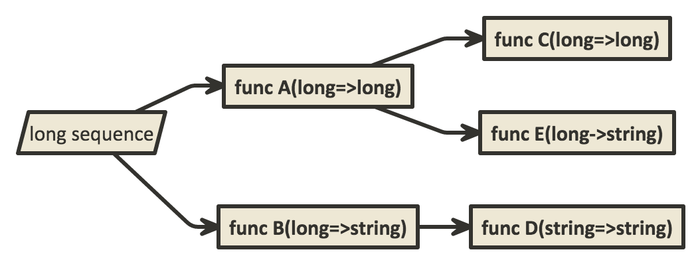
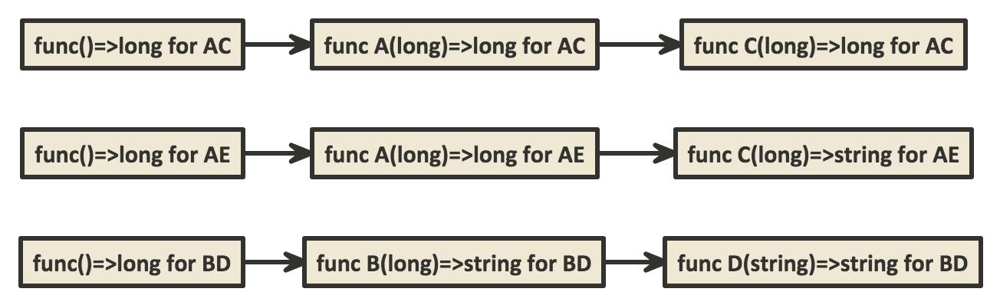
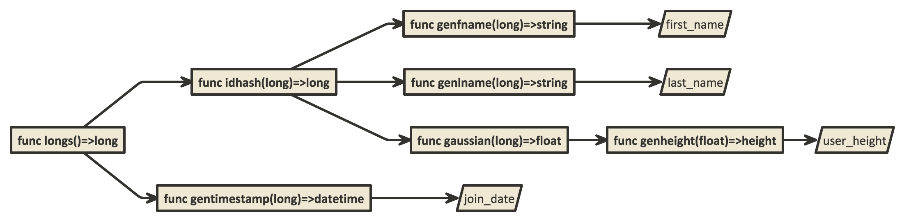

The Function Graph
==================

Each function graph has a logical representation which shows how data is transformed from the original whole number value to the output. Each unique path from the start node to leaf node represents a composed function which maps a whole number to a value.

## Basics

Consider the function graph below. It introduces the functional syntax as well as the data-flow-first representation which is favored in metagener.

The arrows follow the order in which functions are applied to the inner-most data of a function. This representation also allows for the visual arrangement of a related set of functions which can map directly to a realized data source in the runtime. The function names represented by capital letters while the function signatures are captured by the input=>result notation. Of course, all functions must have a compatible type signature. Notice that each function has the same input type as the result type of the function feeding it.

Consider the composition of function E(long)=>string around A(long)=>long. This results in the composed function function E(A(long)) => string. The graph shows 3 different end results, represented canonically as composed functions. They are C(A(long))=>long, E(A(long))=>string, and D(B(long))=>string. What each function actually does to yield its value is not covered here, only the relationship between the functions in the graph.

The original source of data above is simply a sequence or stream of long values. To simplify, this will be represented by a function with an input type of unit, which represents an empty type. This means that every node in the function graph can be represented in terms of functions, even if we are stretching the definition a bit.

As well, this graph represents the logical relationship between different kinds of mappings. If all of the functions are pure, with no side-effects or internal state, then we can build instances of the composed functions at run-time which are highly parallel. Applying both of these ideas to the above graph yields the one below:

In practice, the initial function will be a basic sequence generator.

## Goals

So what does such a simple construct give us? From basic functional principles, we arready know that the input for a given composed function will yield an idempotent result, so long as the functions are pure functions. So far, there is nothing really special going on here.

In order to explain the function graph approach, an example is in order:

There are a few things going on here that we haven't seen before. 

### Fields

First, there are some outputs which have names. Those have been marked with slanted boxes. These nodes represent variable names to which the results of each composed function will be assigned. They are called _fields_ in metagener.

### Sampling

By using a robust hash function as the RNG, it is possible to combine determinism with statistical distributions. To be fair, _deterministic sampling_ is an oxymoron. This ...

### Flexible Structure

The graph shows one field "join_date" as having a completely different composed function than the others. Te 

	#direction: right
    [<input> long sequence]

    [long sequence] -> [func A(long=>long)]
    [long sequence] -> [func B(long=>string)]
    [func A(long=>long)] -> [func C(long=>long)]
    [func B(long=>string)] -> [func D(string=>string)]
    [func A(long=>long)] -> [func E(long->string)]

    #direction: right
    //[<start> start] -> [long sequence]

    [func()=>long for AC] -> [func A(long)=>long for AC]
    [func A(long)=>long for AC] -> [func C(long)=>long for AC]

    [func()=>long for AE] -> [func A(long)=>long for AE]
    [func A(long)=>long for AE] -> [func C(long)=>string for AE]

    [func()=>long for BD] -> [func B(long)=>string for BD]
    [func B(long)=>string for BD] -> [func D(string)=>string for BD]
    
    
    #direction: right

	// example
    [func longs()=>long]
    [func longs()=>long] -> [func idhash(long)=>long]
    [func idhash(long)=>long] -> [func genfname(long)=>string]
    [func genfname(long)=>string] -> [<input> first_name]
    [func idhash(long)=>long] -> [func genlname(long)=>string]
    [func genlname(long)=>string] -> [<input> last_name]
    [func idhash(long)=>long] -> [func gaussian(long)=>float]
    [func gaussian(long)=>float] -> [func genheight(float)=>height]
    [func genheight(float)=>height] -> [<input> user_height]
    [func longs()=>long] -> [func gentimestamp(long)=>datetime]
    [func gentimestamp(long)=>datetime] -> [<input> join_date]
