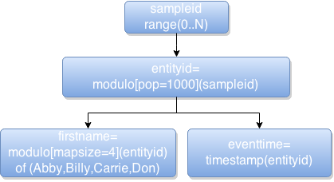

## How to build generator functions

First off, if you haven't read about metagener concepts, yet that is essential reading for this section. Please read [Metagener Concepts](metagener_concepts.md) first.

This guide will show how to build some basic generator functions, step-by-step.

### Entities

First, you must define an entity, as described in the concepts guide.

    // define a 'user' engity with a population of 1000
    entity user pop=1000

Entities have no control over how they will be used. Hence, there is no way to assign any type of generator function directly to an entity.

### Fields

Also, entities provide no meaninful data in and of themselves. The fields of an entity, however, do provide information. Let's add a field to the entity above.

    entity user pop=1000 
     // define a 'firstname' field on 'users', with a value type of 'text'
     field firstname : text

Notice that the field and comment for it are indented. This is merely a convention for readability. Metagener DSL doesn't really care about spaces and tabs.

### Field Generator Functions

The field, _firstname_, has a value type of _text_. So far, we've added a field to the entity, but we've said nothing about how values for that field should be generated. Let's add a simple generator function to it.

    entity user pop=1000 
     field firstname : text <- oneof('Abby,Billy,Carrie,Don');

This uses the __<-__ symbol, simply a less-than and a dash. This can be read as __generated by__. So, firstname values are _generated by_ the function __oneof('Abby,Billy,Carrie,Don')__.

In this case, one of the values in the list of comma-separated values is chosen as the value for firstname, for each unique entity instance.

That last bit was important. We haven't yet discussed the notion of unique generator instances yet. However, we can still say that for each unique entity, the fields for it will have the same values. Sometimes this is desirable, others not. Don't worry if you are thinking that this means you can't change field values for an entity. That comes later.

Now, with this basic entity, we haven't talked about how we might access it. Well, you can't access it directly. Entity definitions serve only to create an instance factory of sorts. However, we still have this obscure issue of of entity uniqueness that we have to resolve. It can only be resolved by providing some tangible identifier to associate with the entity.

As a rule, each entity is identified by a single long value, meaning -2^63 - 2^63-1, or -9223372036854775808 .. 9223372036854775807.

This value, with respect to entity uniqueness, is called an _entity id_, known from now on as __entityid__. We do not concern ourselves with the the entityid as a rule. We only need to know that it is the logical "input" into a generator function for a field.

## Samplers
If we do not use an entityid directly to generate field values, then how do we do it? Before answering that question, I'd like to ask a couple more first. What if you want to know the full set of entities and associated field values in a defined population? What if, instead, you wanted to access a random sampling of them according to some probability distribution? What if you wanted to access the entities in a population in a myriad of ways? Would you want to have to define it in every different way that you might want to ask for it? No, probably not. Hence, entities and fields are not enough to describe how you want to access them-- how you want to draw samples from the entity population, in other words.

For that, you need to define a sampler. A sampler is a defined access point to an entity and its field values. However, a sampler allows you to do something that the entity has no control of. A sampler allows you to define exactly how you want to draw samples from the entity population.

As a thought experiment, assume you are doing a statistical study of 1000 people. Suppose that you want to know about their favorite hobbies and their favorite foods and their travel habits. You could ask them to all line up according to age to provide their basic demographics, one at a time. This is one way of accessing their information, serially. It might not be a proper random sample. Suppose, alternatively, that you did want a proper random sample. You could then draw a random entityid from a hat, roll a few d10s, or some other method to pick one at random, and so forth. You would still see them one at a time, but the order would not be in the same enumerated order. In fact, you wouldn't be able to predict the order. If you drew samples without replacement, you'd only see each one of them once at most, but you might not see them all unless you drew 1000 samples, in which case, you really aren't sampling a population. You're just visiting each one. In any case, you want to be able to control how you draw samples from a population.

That's what a sampler does. It can be a basic sampler which does nothing but provide the next available entityid in order, or it can be something more useful, like a sampler that uses a probability distribution to simulate a certain statistical bias in selection. You do not have to stop drawing entity samples from a sampler once you've reached a certain number-- not unless you intend to. Actually, you can just keep drawing samples from a named sampler. If a sampler has been configured with a maximum number of samples, then it will stop yielding values at that point. However, samplers are not limited in the number of entity samples they will provide by default. (apart the maximum representable value).

Let's add a sampler for the users entity:

    entity user pop=1000 
     field firstname : text <- oneof('Abby,Billy,Carrie,Don');
    // create a sampler which draws entity samples from users
    sampler user_samples : users

Just as with an __entityid__, we also have the idea of a __sampleid__. If you know the sampleid of an entity sample, then you can ask for it again to get exactly the same result. Once you acquire an entity sample, you can see both values. With this simple sampler, we have defined no __entity sampling function__. Instead, the default entity sampling function will be provided automatically: the pmodulo() _entity sampling function_. This function takes the value of ___sampleid % entity population___ as the logical __entityid__. So then, the working definition is equivalent to this one:

    entity user pop=1000 
     field firstname : text <- oneof('Abby,Billy,Carrie,Don');
    // create a sampler which draws entity samples from users
    sampler user_samples : users <- pmodulo();

This means that you will always get an entity sample that corresponds to a logical entityid, no matter how large the sampleid gets. It also means that the inputs to the field function will always be in the range 0..999, inclusive. Since the oneof function does an additional modulo against its input, the __entityid__, then the firstname values will simply rotate as you access subsequent entity samples from the user_samples sampler.

## Composing Generator Functions

What if you want to have some fields which are stable to the logical entity, but others which are not? An example of this would be recording user events in a web application. Suppose you want the user-specific fields to work as discribed above, but that you have another field, named 'eventtime', that you want to have monotonically increasing over time. (aka over the runtime of the test or simulation). If you were to add such a field, it would look like this:

    entity user pop=1000 
     field firstname : text <- oneof('Abby,Billy,Carrie,Don');
     field eventtime : timestamp
    // create a sampler which draws entity samples from users
    sampler user_samples : users

 The equivalent function graph is shown to the right.  However, with no assigned field generator function, the eventtime would take the default generator function for the timestamp type: A simple boxed type around the long value passed into it as the __entityid__. This is clearly not what you would want for a timestamp that increases in step with the __sampleid__. These scenarios are easily supported. When we discussed the entityid and sampleid above, we glossed over something that happend for us automatically. Internally, the metagener runtime wired the _entity sampler function_ onto the front of the _field generator function_. If we were to describe it in purely functional terms, then we could say that the field generator function __oneof(...)__ was composed around the entity sampler function __modulo()__, yielding the function __oneof(modulo())__. Notice that there is not an internal parameter, such as in __oneof(modulo(s))__. With the generator functions, the input and output will always be there, so we elide it as a rule.

Another way to say this is as follows: The entity sampler function is implicitly prefixed onto the field generator function chain. This is an important point. It means that each time you access an entity sample through a sampler, the field generator function you are actually using is dependent on the (entity, sampler) tuple. Field generator functions therefore are not complete enough in and of themselves to create the whole composed function at runtime. They are a template of a composed function, and are used as needed to create a sampler and entity and field specific version of a composed function.

But, since we saw that __oneof(modulo())__ was the composed function, is there a way for us to state this literally in the definition? Yes, and no. For now, field functions must be composed in a chained-function form. That simply means that the above composed function has to be expressed as __modulo();oneof(...)__. This form fits more closely to a data-flow mentality, reading from left to right, as input and output from one function to another. This also makes thinking about how to compose complex functions in a graph more natural.

In order to create the eventtime field above as a monotonically increasing timestamp value (our sampleid is monotonically increasing by default), we simply have to tell Metagener not to use the default convention of applying the entity sampling function to the field generator function. The way we do that is simple:

    entity user pop=1000 
     field firstname : text <- oneof('Abby,Billy,Carrie,Don');
     field eventtime : sampleid();timestamp
    // create a sampler which draws entity samples from users
    sampler user_samples : users

 Now, the function graph looks like this: By putting the __sampleid()__ at the front of the function chain for eventtime, we have instructed metagener to not use the implicit __entityid()__ function. The field generator functions will always need an input. By default, Metagener assumes that you want the entityid() implicit function applied to determine the entity id. If that is not the case, then simply put sampleid() at the front of your field generator function to tell it otherwise. While this is implicit, in most cases you will want to have stable fields according to your logical entity type. If you want to make it more explicity, simply put entityid(); in the front of all your field generator functions.

## Entity and Sampler aware functions

Some functions are implemented in the code base with the requirement that they are initialized with the sampler or entity that they are going to be used with. This allows some functions to be initialized at runtime based on the population of your entity, for example. Population sampling functions are just that. They are aware of the size of the population for the entity that they are being used for, hence they can automatically adjust to reasonable settings according to normative expectations.

## Using Probability Distributions

There are a few ways to use probability distributions to simulate real data patterns. Metagener uses the apache commons math library for its distributions.
All of the distributions available in that library are available for use in a distribution function. Various distribution sampling functions are provided, accomodating both continuous and discrete sampling, as well as population-based auto sizing of sampling functions. These sampling functions are named accordingly:

* cdist(&lt;distname&gt;,...) -- "continuous distributions" -- for sampling over the reals, according to the standard parameters for the named distribution.
* ddist(&lt;distname&gt;,...) -- "discrete distributions" -- for sampling over the integers, according to the standard parameters for the named distribution.
* pdist(&lt;distname&gt;) -- "population distributions" -- for sampling over the entityid space, essentially the range of values between 1 and the population size for the entity being sampled. The distname must be a discrete distribution (integers). The function will auto-size it's parameters according to the documentent auto-sizing rules for that distribution and the entity population.
* sddist(&lt;distname&gt;,&lt;min&gt;,&lt;max&gt;,&lt;pct&gt;) -- "sized discrete distribution" -- for sampling over a range of values using auto-sizing. The funtion will auto-size it's internal parameters according to the documented auto-sizing rules for that distribution and the min and max.
* scdist(&lt;distname&gt;,&lt;min&gt;,&lt;max&gt;,&lt;pct&gt;) -- "sized continuous distribution" -- for sampling over a range of double values using auto-sizing. The function will auto-size its internal parameters according to the documented auto-sizing rules 

Auto-sizing simply means that the probability distribution will be configured according to a range of intended output values. The intent is to use a standard parameter form for all the distributions, such as &lt;distname&gt;,&lt;min&gt;,&lt;max&gt;,&lt;pct&gt;, where &lt;pct&gt; is the percent of all possible values which are intended to be within the bounded sample space. For example, if you were pulling floating-point samples from a gaussian distribution, you might want to include up to the 3rd standard deviation, without considering the longer tail of values. That would be a &lt;pct&gt; value of 97.7.

#### Distribution Sampling and Idempotency

All of the probability distribution sampling functions exhibit the same behavior with respect to idempotent results. In other words, a given metagener sampler will always produce the same sequence of outputs from the beginning. Field 'foo' from the 7343rd sample will always have the same value, even if it was drawn in some way from a probability distribution. However, all values of field 'foo' should have the distribution specified, when taken across the individual samples.

This is achieved by manually controlling the RNG, which is fed to the inverse CDF sampling methods, deriving random-enough RNG streams from the murmur3 hash of the input. This is handled automatically by the distribution sampling functions.

## Higher-Order functions

Some functions can take other functions. One example of such a function is the resample(&lt;function&gt;,&lt;min&gt;,&lt;max&gt;&lt;limit&gt;) function. This function is useful to deal with statistical sampling functions which sometimes find values outside of the allowed range. The resample function will keep an internal offset to the input value, and retrigger the called function up to limit times in order to find a value in the required range. It will memoize the offset for future calls to avoid unneeded retriggers of useless values. This is preferable to simple clamping in some cases, since clamping can cause values to stack up at the clamping boundary. If this is not a concern for your test, then it might make more sense to use the clamp(&lt;min&gt;,&lt;max&gt;) function instead.

