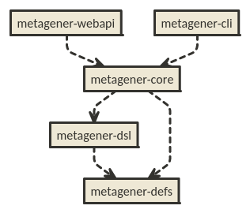

Metagener Intro
===============

Metagener is a toolkit data generation. It provides a conceptual model for describing data sets, a domain-specific language for configuration, and a runtime for creating and interacting with streams of generated data.

## Why?

≈Most testing tools treat the data as an unfortunate implementation detail. In some _extensible_ systems, data takes the form of a custom class, being tightly bound with one-off code. In other cases, the data remains boring and overly-generic-- not specific or relatable to a given data model, data access pattern, or user behavior. Most of the time, it is limited to simple CRUD-style templates, not a sufficient approximation for any non-trivial design.

These problems create an impedence mismatch between the goals of most users and the tools they have to attain them. They may spend disproportionate effort to build a testing tool which is meaningful to their application. Perhaps worse, they may spend no effort in getting results which are specific and meaningful to their intended system design. The two key dimensions of this problem are effort and expressivity.

Metagener endeavors to solve these problems head-on. In order to do so, it must be able to describe data in a flexible, yet intuitive way. It must also provide a conceptual toolkit which makes constructing more nuanced data possible. It should be easy to describe the most mundane data in a mundane way, but possible, even intuitive to construct recipes for complex data as needed.

_Simple things should be simple. Complex things should be possible. -- Alan Kay_

## What?

Metagener is intended to be one of the tools that I've always wanted for empirical testing. To be clear, there are certain design features that have generally been lacking in the tools I've used. This is a short list of what makes metagener unique:

* statistical generation with determinism -- Choose what level of apples-to-apples you need. Use [established statistical sampling techniques](http://en.wikipedia.org/wiki/Inverse_transform_sampling), but also have the ability to replay the same exact data if you like. Statistical simulation techniques and replay determinism are not mutually exclusive.
* composable data generator functions -- Use a library of functions which can be chained together to produce trivial or non-trivial data streams of data.
* a data generation language -- Metagener provides a simple and targeted language for building data generation recipes. Paste one in email and send it to a friend.
* random access to idempotent sample data -- The data stream can be accessed in order, or randomly, yielding the same values for a numbered sample.

## Usage

Metagener can be used on one of several ways:
* As a Java runtime API
  * Metagener DSL
  * fluent API
  * Metagener YAML
* As a RESTful service

Each of these will be linked and documented separately as the documentation improves.

The preferrable method is to use the configuration DSL, since this provides the most portable format for configuring a metagner runtime. In the future, you should be able to use drop the same .metagener file into any metagener runtime and get a useful stream of data, no matter what the language.

## Metagener Components

The first implementation of Metagener is in Java. There may be other runtimes for it in time. For now, it is packaged as a jar, using Maven 3.

The configuration model is kept in 'metagener-defs'. The 'metagener-syntax' module depends on it. 'metagener-core' depends on both, and 'metagener-webapi' depends on that:

