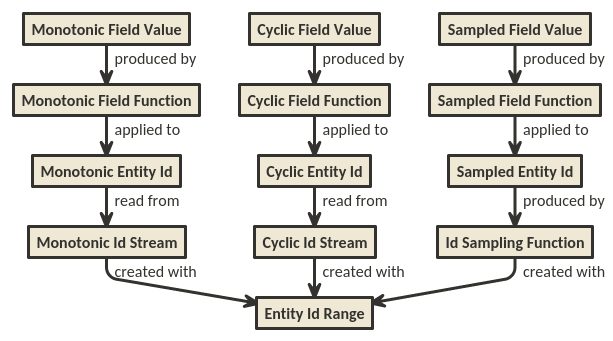

Sampler Construction
====================

## Synopsis
This document is really a design sandbox that I hope will 1) help me refine and and simplify the core design of metagener, and 2) help others understand the motives driving the design.

## Basics
Each value generated for a field is produced by a pipeline of streams and mapping functions. The graph below shows the outputs at the top, with dependencies going down to the original source of input, the entity id range.

Every field value output can be considered a result of a composed function, where the inner-most input is simply a sample id. In this way, you can construct whatever form of generated data you need. The reason this is important will be explained in detail below. 

This graph is meant to convey the behavior of the streams, but should not be construed to mean that you have to manage this many functions and streams in order to generate a field. It simply demonstrates that if you use a pure monotonic function on a standard (monotonic) input, the result will be monotonic. As well, the same function applied to a cyclic input will produce a cyclic output. The same holds for "samples" -- A pure monotonic function applied to a pseudo-random input will appear to have a pseudo-random output. Hence, the focus is more on combination of source data stream and function pipeline, and not on solely on the functions themselves.

### Finite Samples
The most basic possible pipeline arrangment is on the left. Monotonic values simply mean that the value is either constantly increasing, or constantly decreasing. The proper algebraic definition is more strict than this. For our purposes, we will use monotonic to describe functions or sequences of outputs which are strictly increasing, such as a timestamp for recorded fact data.

On the left of the chart, everything is monotonic. The stream of number produced strictly goes from the lowest to the highest (open interval on the right). More specifically, once the values have been used, there are no further values. The range is a strict definition for all the possible sample ids that can be consumed.

This might be important when you want to populate a database with all of the elements of a given entity type. You can consume such a stream of numbers till then end in order to see each one exactly once.

Finite sampling is useful for seeing all of the defined population of a particular entity type. However it has limits, see below.

#### A More Realistic Scenario
Consider a scenario in which you want to multiplex one type of data against another. An example of this would be a finite set of data sources with event data collected over time. You might want to record events from each of these data sources with a timestamp. In this scenario, your data sources would fit the model of a finite sample, while the timestamps for your events would appear monotonic. You would have many events for a given data source, but only one event per data source per time stamp. In this case, the finite sampling approach is not appropriate. Taking an individual sample for each value in the sampling range will not work. You need to be able to see each data source many times over the lifecycle of the test, which means some form of repeating.

#### Repeating by Wrapping
If you want to see repeats of a given set of fields (corresponding to a component of a denormalized event log), then you can simply repeat the range of values over and over again. This simplifies the field generator logic for your fields which should have repeated values, but complicates it for other fiels which should contain monotonic values, such as timestamps. In this case, wrapping your sample id range is not the best solution either. It would be useful to have generator logic for the monotonic fields which depend on an ever-increasing input, but still allow the field which will have repeated values to have cyclic inputs.

#### Repeating by Modulo
In order to support the monotonic requirements of time-stamp fields as well as repeating requirements of other fields, the best approach appears to be an ever-increasing monotonic input. With this approach, repeating fields can be generated simply by applying the modulo of the population size as one of the functions for certain fields, while allowing the monotonic fields to remain simple. One trade-off of this approach is that the modulo will create roughly isochronous data for each of the repeating fields. This is realistic for some cases, and unrealistic for others. For those, see below...

#### Repeating by Sampling
Another approach to repeating field values is to select one of the population range at random. This means that you can select a uniform distribution to see each possible value at about the same overall rate-- with no gaurantee of the momentary rate for any particular one. It also means that you can use other distributions, like gaussian or pareto to simulate other patterns of realistic system behavior. This is also a valid approach, and is probably more realistic for most scenarios.

##### Pure Sampling
One form of sampling does not involve the sample id hash. This is called _Pure Sampling_ in this document. Note, that this does not mean that the samples are based on cryptographically strong entropy. (That would probably be too slow to be useful, anyway.) What it means in this context is that the input to the function which produces your field values is not directly related to the sample id. The library will allow you to construct such types of functional pipelines, where one of your intermediate functions generates something that is not idempotent with respect to the standard inputs. There may be a need for this at some point, but for now, Hash Sampling as explained below should be used in most of the functions.

##### Hash Sampling
_Hash Sampling_ , as named in this document, describes the combination of using a hash against the sample id in order to provide an input into a statistical sampling function. This is useful in the sense that it can produce data that fits either a population distribution (with respect to a discrete sampling population), or values which follow a distribution. This data will approach the target distribution as more values are drawn from it.

#### Consolidation
In order to support the samantics of sample id, entity identity, timestamps, manifest reads, and idempotent field values, I'm proposing a new model:

#### Cycling by Modulo

## Documentation TODOs

TODO: Explain the difference between sample id and entity id.

TODO: Explain the difference in approach between combining sample strategies and interleaving sample streams.

TODO: Explain that functions that expect int-sized long values as inputs should throw overflow exceptions, but that IntModuloLong can downscale

TODO: Explain unresolved design issues:

TODO: Maybe function<i,o> is only part of the chained interface. Maybe a function context is passed along which is immutable for extant fields,
but which can have additional context data added as it goes.

- Java 8's composable functions aren't really if you use the primitive specializations
- Apache common math is not consistent in it's support for value types.. Some are Int some are Long..

TODO: Explain why you should assume all metagen APIS to not be thread safe, except for those that are explicitly designed and documented to provide
access to multiple threads.

TODO: Explain that all samples are presumed to be "with replacement", meaning that sampling a specific entity id does not mean that it is no longer available for sampling. An exception to this would be a sampler that simply returns the population.
Explain the caveats for int and long interoperability

TODO: Explain how to guarantee unique entity ids:
- When sampling by distribution, this is not possible without including the sample id as part of the entity id
- When sampling by hash, entity uniqueness will depend on key field values, and hence the generators for the user's notion of what a unique object/record is. In this case, using the sample id as a key field component can also guarantee uniqueness,
but may not be important.

TODO: Explain [inclusive, exclusive) ranges and how they apply to populations and valid entity ids.

TODO: If you set the population to a finite value, but map your field values as if the population is much smaller or much larger, then the field values may not make sense.
This can be particularly strange if you keep reading from the sample stream far after you've consumed the meaningful samples.
For example, 1000 brand entities, with only 3 brand names probably doesn't make sense. Also, 100 well-constructed samples (according
to the sampling method and field mappings) will stop making meaningful distinctions once you exhaust the field data.

A prescribed range of entity ids is used to create a stream of entity ids within the range

